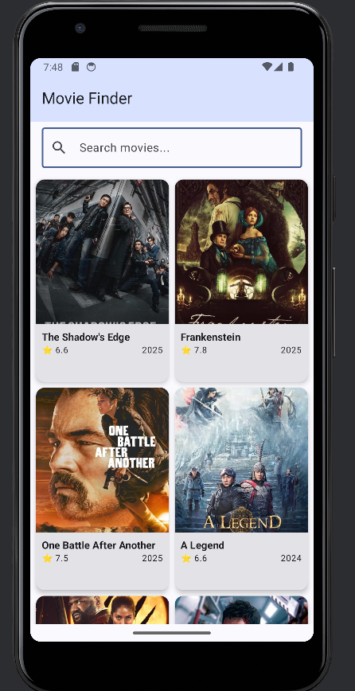

# 🎬 Movie Finder

A modern Android app that fetches and displays popular movies using the TMDB API.

## ✨ Features

- 🎥 Browse popular movies with beautiful poster images
- 🔍 Real-time movie search functionality
- ⭐ Display ratings and release dates
- 📱 Clean Material 3 design
- 🔄 Loading states and error handling
- 🌐 Retrofit for API integration
- 🖼️ Coil for image loading

## 🛠️ Tech Stack

- **Kotlin** - Programming language
- **Jetpack Compose** - Modern declarative UI
- **Retrofit** - REST API client
- **Coil** - Image loading library
- **Coroutines & Flow** - Asynchronous programming
- **MVVM Architecture** - Clean separation of concerns
- **Material 3** - Modern UI design

## 📁 Project Structure
```
com.example.moviefinder/
├── data/
│   ├── model/          # Data models (Movie, MovieResponse)
│   ├── remote/         # API service and Retrofit setup
│   └── repository/     # Data layer abstraction
├── ui/
│   └── screens/        # Compose UI screens
├── viewmodel/          # Business logic and state management
└── MainActivity.kt     # App entry point
```

## 🔧 Setup Instructions

### Prerequisites
- Android Studio Otter (2025.2.1+) or newer
- Minimum SDK: API 24 (Android 7.0)

### Getting Started

1. **Clone the repository**
```bash
   git clone https://github.com/YOUR_USERNAME/MovieFinder.git
   cd MovieFinder
```

2. **Get a FREE TMDB API Key**
    - Go to [TMDB Website](https://www.themoviedb.org/)
    - Sign up for a free account
    - Navigate to Settings → API
    - Generate an API key

3. **Add API Key to Project**
    - Open/Create `local.properties` file in project root
    - Add your API key:
```properties
     TMDB_API_KEY=your_api_key_here
```
- **Note:** `local.properties` is gitignored for security

4. **Sync and Run**
    - Open project in Android Studio
    - Click "Sync Project with Gradle Files"
    - Run the app on an emulator or physical device

## 🔐 Security

- API keys are stored in `local.properties` (not tracked by Git)
- Keys are accessed via `BuildConfig` at compile time
- Never commit secrets to version control

## 📸 Screenshots


## 🎓 What I Learned

- Working with REST APIs using Retrofit
- Managing asynchronous operations with Coroutines
- Implementing MVVM architecture pattern
- State management with StateFlow
- Loading images from URLs with Coil
- Handling loading/success/error states
- Material 3 design principles
- Secure API key management

## 📝 API Reference

This app uses the [TMDB API](https://developers.themoviedb.org/3)

Endpoints used:
- `GET /movie/popular` - Fetch popular movies
- `GET /search/movie` - Search movies by title

## 🚀 Future Enhancements

- [ ] Movie details screen
- [ ] Pagination for infinite scrolling
- [ ] Filter by categories (Top Rated, Upcoming, Now Playing)
- [ ] Save favorite movies locally with Room
- [ ] Dark mode support
- [ ] Share movie functionality

## 📄 License

This project is for educational purposes.

## 🙏 Acknowledgments

- [TMDB](https://www.themoviedb.org/) for providing the free movie API
- Android Developers documentation
- Jetpack Compose community